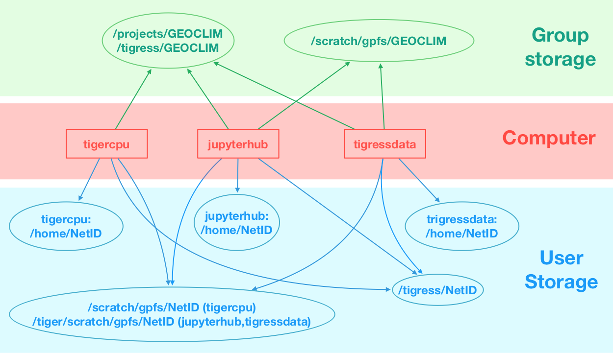

# Table of Contents

1.  [Getting an Account on the Computers](#org31743d4)
2.  [Using the Computers](#orgeef3caf)
    1.  [Which Computer Should I Use for My Research Project?](#org28eba1d)
    2.  [Logging in to the Computers](#org886d72e)
        1.  [tigercpu or tigressdata: use an ssh client](#org1966e7b)
        2.  [Jupyterhub](#org03a7b2f)
        3.  [Connecting from off-campus: use the VPN](#orgb1654c4)
        4.  [What is your username? Princeton NetID](#org9c95c0a)
    3.  [Using the Computers](#orgcfcbaae)
        1.  [The Operating System: Linux](#orgf1d81f2)
        2.  [Using a Remote Desktop on tigressdata: TurboVNC](#orga6b5bf4)
    4.  [Data Storage](#org0657419)
3.  [Going Further](#org0980544)

# Getting an Account on the Computers

To get an account on the Tigress system have your faculty advisor
email David Luet with a request for a new account on `tiger`.  

An account on the `tigercpu` cluster gives you access to:

-   `tigercpu`: the cluster,
-   `tigressdata`: a visualization node,
-   `jupyter.rc`: a JupyterHub host.

# Using the Computers

## Which Computer Should I Use for My Research Project?

When you get an account on the clusters to collaborate with
researchers in the climate group, you are in effect given access to
three machines `tigercpu`, `tigressdata` and `jupyterhub`:

-   `tigercpu` is used to run simulations that require a lot of
    computational power.
-   `tigressdata` is used for visualization and post-processing
    jobs. This machine runs a remote desktop which can make it easier to
    interact with the data, **#todo add link to TurboVNC section**
-   `jupyterhub` is a Jupyter notebook server. It runs the [JupyterHub](https://jupyterhub.readthedocs.io/en/stable/)
    software.

So where should you start?

-   If all you need is run some Jupyter notebooks on some climate
    data, then `jupyterhub` is the best place,
-   If you need to run other programs such as `Matlab`, `IDL`, `ncview`, on
    climate data, then use `tigressdata`. One easy way to use
    tigressdata is through the remote desktop TurboVNC (**TODO: add link**).
-   When you get started, unless you are going to run simulations, you
    should only access tigressdata.
-   If you need to run computationally intensive jobs, then you will
    need to use `tigercpu`. It's best to talk with your research advisor
    to determine whether your work will require tiger.
-   **TODO: Add decision graph**.

## Logging in to the Computers

### tigercpu or tigressdata: use an ssh client

You log in to either `tigercpu` or `tigressdata` through the `ssh` protocol. The remote
machines run the `ssh` server and you use an `ssh` client to it.

Which `ssh` client to use depends on the operating system on your
laptop or desktop:

-   `macOS` comes with an `ssh` client, so you don't need to install
    anything. To access it you will need to start the `Terminal`
    application.
-   `Windows`: `Windows` does not come with an ssh client installed, so
    you need to install one yourself. There are multiple `ssh` client
    available for `Windows`. OIT recommends using [MobaXterm](https://mobaxterm.mobatek.net/). Other
    popular options are [PuTTY](https://www.chiark.greenend.org.uk/~sgtatham/putty/) and, on Windows 10 and higher installing
    you can install [Install Windows Subsystem for Linux (WSL)](https://docs.microsoft.com/en-us/windows/wsl/install-win10). If you
    need help installing or connecting to the remote computers, you can
    go to the [OIT Tech Clinic](https://princeton.service-now.com/snap?id=service_offering&sys_id=6484d6fa4f2e5200b28af7e18110c7c9) in the Frist Campus Center.

When you connecting on a remote host you may need to use the FQDN (Fully Qualified Domain Name) in your `ssh` client application, they are:

-   `tigercpu.princeton.edu`,
-   `tigressdata.princeton.edu`.

### Jupyterhub

`Jupyterhub` web based and you access it by simply going to
<https://jupyter.rc.princeton.edu/hub/home>
in a web browser.

This section:
[jupyter.rc](./jupyterhub.md)
explains how to run Jupyter notebooks on `jupyterhub`.

### Connecting from off-campus: use the VPN

You can only access `tigercpu`, `tigressdata` or `jupyterhub` in either of two scenarios:

1.  you are on campus, or,
2.  you are using the VPN. The instructions for installing the VPN on your machines differ based on your Operating Sytem:
    
    -   [VPN: Secure Remote Access (SRA) instructions for MacOS](https://princeton.service-now.com/snap?id=kb_article&sys_id=952a27064f9ca20018ddd48e5210c719)
    -   [Secure Remote Access (SRA) instructions for Windows 10](https://princeton.service-now.com/snap?id=kb_article&sys_id=612a27064f9ca20018ddd48e5210c72a)
    
    The [OIT Tech Clinic](https://princeton.service-now.com/snap?id=service_offering&sys_id=6484d6fa4f2e5200b28af7e18110c7c9) in the Frist Campus Center can help you install the VPN on your machine.

### What is your username? Princeton NetID

Your username on the Research Computing machines is your Princeton NetID.

Unless you have an alias, your netid is the first part of your
Princeton email address. For instance is your Princeton email
address is `jdoe@princeton.edu` then your `netid` is most likely
`jdoe`.

To be sure what you `netid` is, go to the University's web site:
<https://www.princeton.edu> 
and search for your name, click on the `People` result, look for the `NetID` field.

## Using the Computers

### The Operating System: Linux

The Operating System (OS) on the Research Computing (RC) computers is called [Linux](https://en.wikipedia.org/wiki/Linux). The best way to interact with those computers is through the command line, which is a departure from the Graphical User Interfaces (GUI) that come with the macOS or Windows.

You should spend some time learning the fundamentals of using the command line, not only will it make you more efficient, but avoiding learning it will cost you a lot of time. There are a lot of resources online to learn Linux, here are some recommendations:

-   [Linux Tutorial - Learn the Bash Command Line](https://ryanstutorials.net/linuxtutorial/): this is a well written
    tutorial that covers the basic operations. It is a good place to get started.
-   [LinuxCommand.org: Learning the shell:](http://linuxcommand.org/lc3_learning_the_shell.php)
    -   This is written from the point view of someone running Linux on
        their local machine. So the first part is about getting a shell on
        your local machine. In your case you do not need a Terminal
        running on your local machine, instead you connect on either
        `tigressdata` or `tigecpu` to access a shell. But those sections are relevant and important:
        -   [Learning the shell - Lesson 2: Navigation](http://linuxcommand.org/lc3_lts0020.php)
        -   [Learning the shell - Lesson 3: Looking around](http://linuxcommand.org/lc3_lts0030.php)
        -   You can ignore: [Learning the shell - Lesson 4: A Guided Tour](http://linuxcommand.org/lc3_lts0040.php)
        -   [Learning the shell - Lesson 5: Manipulating Files](http://linuxcommand.org/lc3_lts0050.php)
        -   [Learning the shell - Lesson 6: Working with Commands](http://linuxcommand.org/lc3_lts0060.php)
        -   Initialy, you can ignore: [Learning the shell - Lesson 7: I/O Redirection](http://linuxcommand.org/lc3_lts0070.php)
        -   [Learning the shell - Lesson 8: Expansion](http://linuxcommand.org/lc3_lts0080.php)
        -   [Learning the shell - Lesson 9: Permissions](http://linuxcommand.org/lc3_lts0090.php)
        -   [Learning the shell - Lesson 10: Job Control](http://linuxcommand.org/lc3_lts0100.php)
        -   You can ignore the rest at the beginning: [LinuxCommand.org: Writing shell scripts.](http://linuxcommand.org/lc3_writing_shell_scripts.php)
-   [Software Capentry: The Unix Shell](http://swcarpentry.github.io/shell-novice/)
    -   and a summary can be found here: [Intro to Unix](https://earth-env-data-science.github.io/lectures/environment/intro_to_unix.html#intro-to-unix).
-   If you prefer learning by watching videos, you can look at these:
    -   [LinkedIn: Unix for macOS Users](https://www.linkedin.com/learning/unix-for-mac-os-x-users/): Princeton University has a
        subcription to LinkedIn learning. Even though it is written for
        macOS, section 1 through 8 are relevant to Linux.
    -   [O'Reilly: Linnux command line](https://learning.oreilly.com/videos/linux-command-line/9780134445533): Princeton University has a subscription to O'Reilly.

### Using a Remote Desktop on tigressdata: TurboVNC

You can get a full Linux desktop environment on `tigressdata` through
a remote desktop software called [TurboVNC](https://www.turbovnc.org/). The primary use of TurboVNC
is to use visualization software remotely in an efficient maner. There
are two added benefits:

1.  Your TurboVNC session is stays open until `tigressdata` is
    rebooted. This means that you can start working in one location,
    close your laptop, go somewhere else and resume your work: the 
    processes you started are still running. This is to be contrasted
    to connected through the `ssh` client where your process are killed
    as soon as the `ssh` session is dropped.
2.  Having a full graphical desktop environment makes it easier to
    interact with the operating system. You can use the graphical
    interface to manipulate and edit files for example. But remember
    that `TurboVNC` is only available on `tigressdata`.

To use `TurboVNC` you need to install and configure it. One good
reference on how to use it on the RC systems is:
[How do I use VNC on Tigressdata?](https://researchcomputing.princeton.edu/faq/how-do-i-use-vnc-on-tigre)
The  [OIT Tech Clinic](https://princeton.service-now.com/snap?id=service_offering&sys_id=6484d6fa4f2e5200b28af7e18110c7c9) can also help you install it and use it on `tigressdata`

## Data Storage

There are multiple places where you can store the data for your project.
There are two major types of storage:

1.  storage that is reserved for a specific user,
2.  storage that is shared with the climate modelling group.

The storage locations reserved for user `NetID` are:

-   `/home/NetID`: each of the three machines have their own `/home`
    partitions that only a specifc machine can access.
-   `/tigress/NetID` and `/scratch/gpfs/NetID`: all three machines share
    these partitions. Note that `/scratch/gpfs/NetID` is accessed from
    `tigressdata` and `jupyther` from `/tiger/scratch/gpfs/NetID`

The storage locations shared by the group are:

-   `/projects/GEOCLIM` and `/tigress/GEOCLIM`: `/tigress/GEOCLIM` is an
    alias (a symbolic link) to `/projects/GEOCLIM`.
-   `/scratch/gpfs/GEOCLIM`: Note that `/scratch/gpfs/GEOCLIM` is
    accessed from `tigressdata` and `jupyther` from
    `/tiger/scratch/gpfs/GEOCLIM`.

The figure below shows the different storage locations as well the
machines that can access them. A machine can access a storage location
if it has an arrow pointing to it.

There are three factors that differentiate the filesystems `/home`, (`/tigress`, `/projects`) and `/scratch/gpfs`:

1.  size: `/home` is limited, (`/tigress`, `/projects`) and
    `/scratch/gpfs` are large.
2.  speed of access: `/home/` and `/scratch/gpfs` are fast, `/tigress`
    and `/projects` are slow.
3.  backup: `/home` is backed up every day, `/tigress` and `/projects`
    are backed weekly, `/scratch/gpfs` is not backed up.

Selecting a location for your data can be overwhelming at first, so to
get started, assuming that your are working in the Resplandy group,
follow those steps:

1.  Create your own directory in `/projects/GEOCLIM/LRGROUP` e.g.:
    
        $ mkdir /projects/GEOCLIM/LRGROUP/$USER
    
    where `$USER` should be automatically replaced by your `NetID`.
2.  Store your data there.

# Going Further

-   This is an interesting online book that Julius Busecke contributed to:
    [An Introduction to Earth and Environmental Data Science](<https://earth-env-data-science.github.io/intro>).

