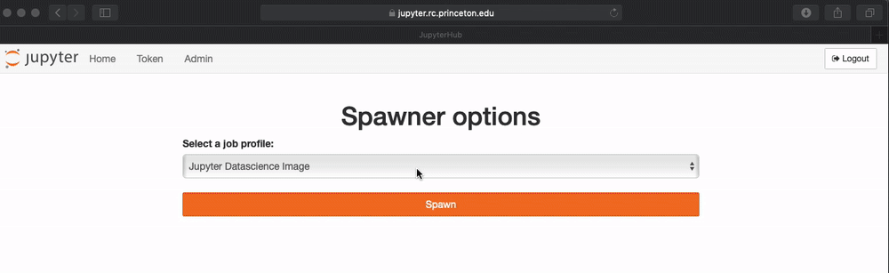
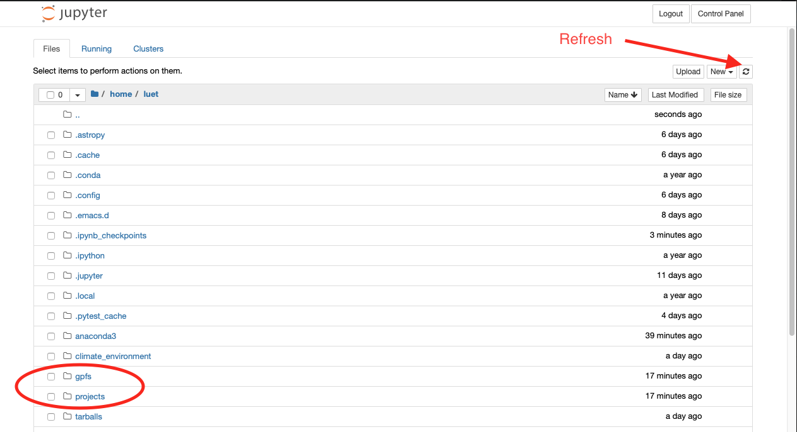
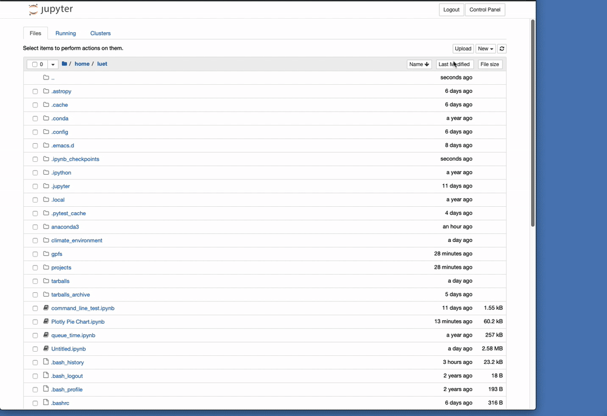
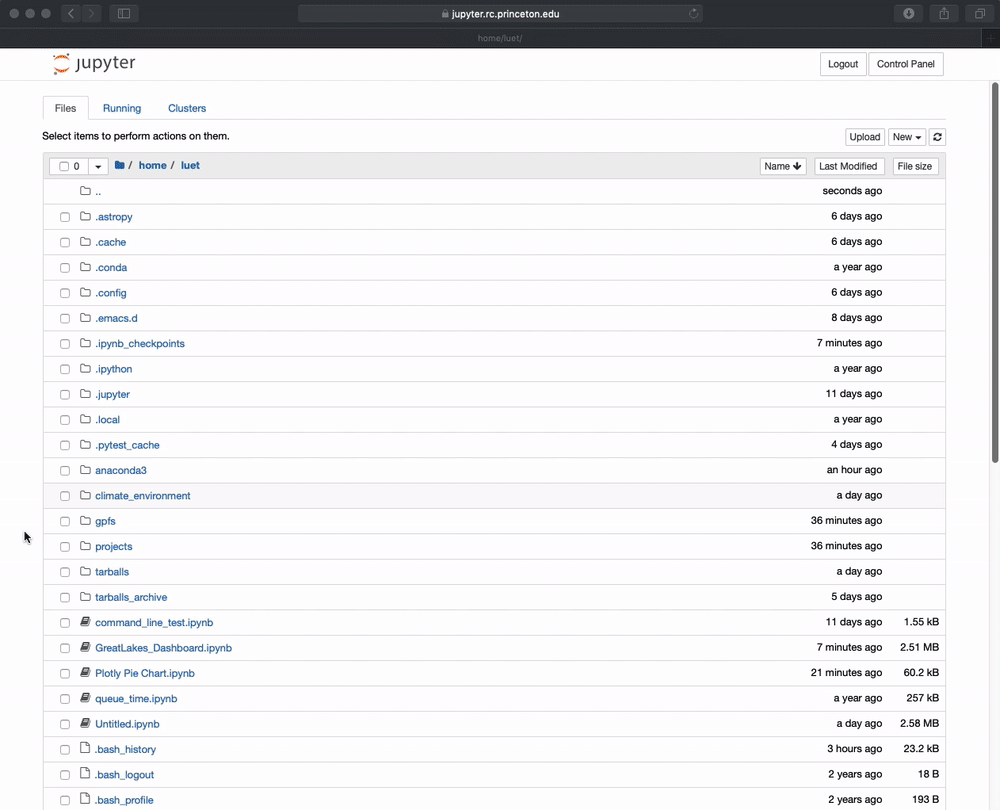

# Table of Contents

1.  [First time setting](#org61c1b22)
2.  [Accessing data on `/project` or `/scratch/pgfs`](#orgea5b054)
3.  [Uploading Files](#org24ef564)
4.  [Downloading Files](#org2f209d4)

# First time setting

-   Go to 
    <https://jupyter.rc.princeton.edu>
-   You will need authenticate with your Princeton `netid` and password.
    
-   In `Spawner options` select `Anaconda3 2019.07 in home directory -
      Climate Modeling`.  Note that the building the image the first time
    will take about 3 min. Afterthe first build it will be faster.
    

# Accessing data on `/project` or `/scratch/pgfs`

-   The server `jupyter.rc` is independent from the cluster `tiger` but
    has access to both `/tigress` and `/scratch/gpfs` on tiger. For
    convenience, create some symbolic links in your home directory.
    
    You can do this by opening a terminal by clicking on `New` then `Terminal`.
    
        $ ln -s /projects/GEOCLIM projects
        $ ln -s /tiger/scratch/gpfs/GEOCLIM gpfs
    
    
-   After this, the directories `projects` and `gpfs` will be in your
    home directory. You may need to refresh your browser to see them
    

# Uploading Files

To upload a file click `Upload`
  

# Downloading Files

To download a file click the file and `Download`. The file will be
  downloaded where your browser downloads files.
  

