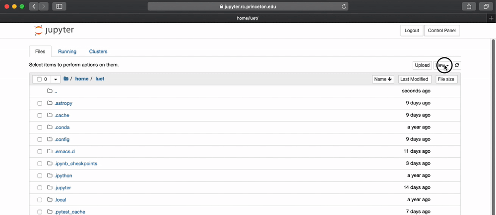

# Table of Contents

1.  [First time setting](#org11737a2)
2.  [Accessing data on `/project` or `/scratch/pgfs`](#orgf145dfd)
3.  [Uploading Files](#orgabc9125)
4.  [Downloading Files](#orgdd6668b)
5.  [Troubleshooting: rebuilding the environment from scratch](#orgd81919f)

# First time setting

-   Go to 
    <https://jupyter.rc.princeton.edu>
-   You will need authenticate with your Princeton `netid` and password.
    
-   In `Spawner options` select `Anaconda3 2019.07 in home directory -
      Climate Modeling`.  Note that the building the image the first time
    will take about 3 min. After the first build it will be faster.
    

# Accessing data on `/project` or `/scratch/pgfs`

-   The server `jupyter.rc` is independent from the cluster `tiger` but
    has access to both `/tigress` and `/scratch/gpfs` on tiger. For
    convenience, create some symbolic links in your home directory.
    
    You can do this by opening a terminal by clicking on `New` then `Terminal`.
    
        $ ln -s /projects/GEOCLIM projects
        $ ln -s /tiger/scratch/gpfs/GEOCLIM gpfs
    
    
-   After this, the directories `projects` and `gpfs` will be in your
    home directory. You may need to refresh your browser to see them
    

# Uploading Files

To upload a file click `Upload`
  

# Downloading Files

To download a file click the file and `Download`. The file will be
  downloaded where your browser downloads files.
  

# Troubleshooting: rebuilding the environment from scratch

If your Anaconda environment as been corrupted or you think
something is not working properly. You can rebuilt your environment
from scratch by following this procedure:

1.  from a running notebook on `jupyterhub` open a `Terminal`,
2.  remove your current `anaconda3` directory with:
    
        rm -Rf $HOME/anaconda3
3.  log out,
4.  click `Stop My Server`,
5.  click `My Server`,
6.  rebuild the environment following the steps described in [First time setting](#org11737a2).

